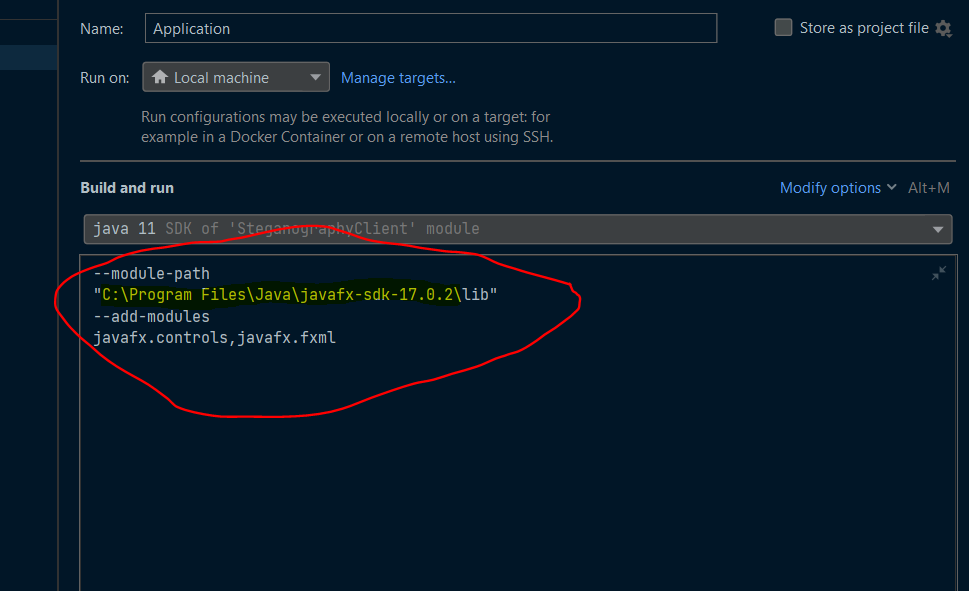

# Как установить клиент

### Скачать к себе на машину:
1) Java 11+ (https://www.oracle.com/java/technologies/javase/jdk11-archive-downloads.html)
2) Intellij Idea (https://www.jetbrains.com/idea/download/#section=windows)
3) JavaFX SDK (https://download2.gluonhq.com/openjfx/19/openjfx-19_windows-x64_bin-sdk.zip)

##Установка
1) Склонируйте репозиторий
   
   

2) Настройте параметры запуска
   
   
   
   
    Скопируйте параметры:
   --module-path
   "C:\Program Files\Java\javafx-sdk-17.0.2\lib"
   --add-modules
   javafx.controls,javafx.fxml
    ####ВАЖНО!!!
    Вместо C:\Program Files\Java\javafx-sdk-17.0.2 должен быть путь к JavaFX SDK на ВАШЕМ компьютере
   

### Сборка
```
mvn clean package
```

### Запуск
```
Стрелочку нажми, или Shift+F10
```


